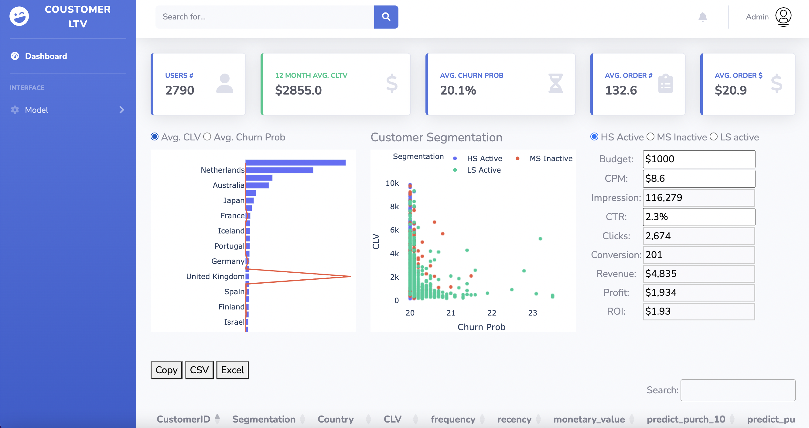

# Customer Life Time Value Dashboard

**Author**: Wenxuan Zhang 

**Contact**: ll.wxzhang@gmail.com

Welcome to the Customer Lifetime Value (CLV) Dashboard, a powerful tool for tracking and analyzing customer data. This dashboard helps businesses make informed decisions by estimating customer lifetime value and segmenting their customer base.

## Dashboard Overview

### Data
*  **Data Source**:[Online Retail Data](https://github.com/WenxuanZhang/clv_dashboard/blob/master/dashboard/data/data.csv)
*  **Data size:** 541,909 rows and 8 columns
*  **Stardate:** December 1, 2010
*  **Enddate:** December 9, 2011

### Use Case
1. **Estimate Customer Lifetime Value:** Utilizing the BYTD (Buy Till you Die) BG/NBD model and NB/Gamma-Gamma model, this dashboard provides insights such as:
   * Customer lifetime value over the next 12 months
   * Predicted customer orders in the next 10, 30, 60, and 90 days
   * Probability of customer churn
  
2. **Customer Segmentation and ROI Analysis:** The dashboard offers solutions for customer segmentation and simulates ROI analysis based on industry benchmarks.

### Dashboard Snapshot

### Tech Detail
* **Web Application**: Python Flask, Javascript, HTML, CSS,Jquery, Datatable, Pandas, 
* **Model**: Python scikit learn, lifetime packages
* **Deployment**: AWS Elastic Beanstalk, AWS EC2, AWS CodePipeline, Github

### Project Link

Explore the dashboard here: [Customer Life Time Value Dashboard](http://clv-env.eba-mhpngfmf.us-east-2.elasticbeanstalk.com/)

Feel free to reach out to the author, Wenxuan Zhang, at ll.wxzhang@gmail.com for inquiries or feedback.

Thank you for using the CLV Dashboard to enhance your business analytics and decision-making!

